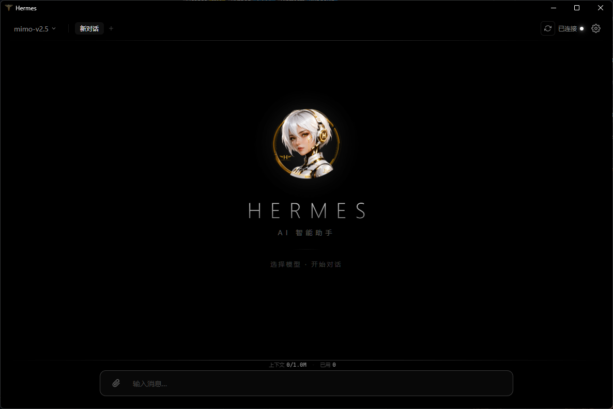
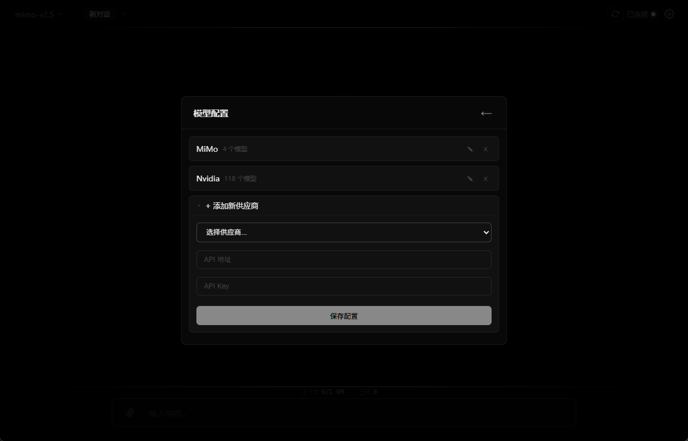
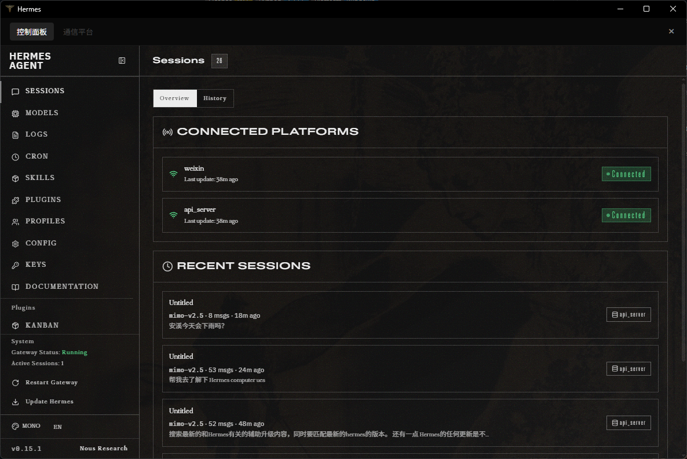
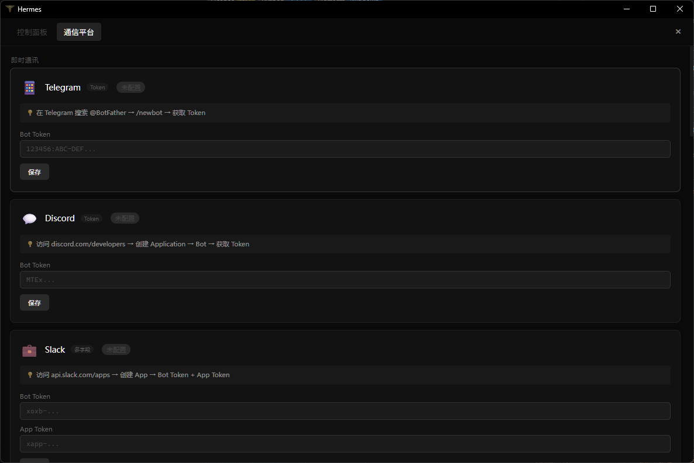

<div align="center">

# ✦ Hermes Pulse

**Hermes Agent 的原生桌面客户端 — 轻于形，智于心**

纯黑美学 · 呼吸光效 · 零框架 · 30MB 内存 · 开箱即用

[](LICENSE)
[](https://python.org)
[](https://windows.com)
[]()

**[English 🌐](README_EN.md)**

</div>

---

## ✨ 什么是 Hermes Pulse

> ⚠️ **当前版本仅支持 Windows 10/11**（基于 pywebview + WebView2，Windows 原生组件）。macOS / Linux 适配已列入路线图。

Hermes Pulse 是 [Hermes Agent](https://github.com/NousResearch/hermes-agent) 的**原生桌面客户端**。

它不是又一个 Electron 包壳，不是又一个浏览器标签页——它是基于 **pywebview + WebView2** 打造的真正原生窗口，专为 Windows 而生，与系统浑然一体。

**设计哲学：轻于形，智于心。**

我们相信 AI 客户端不应该是臃肿的。Hermes Pulse 的全部前端代码不超过 200KB，运行时仅占 30MB 内存，启动不到 2 秒——但它的每一个像素、每一帧动画、每一次交互，都经过精心打磨。

> *我们不堆砌功能，我们打磨体验。*
> *我们不追求"大而全"，我们追求"轻而强"。*
> *每一次呼吸光效的脉动，都是 Hermes 智能状态的外化。*

---

## 📸 界面预览

| 主界面 | 模型选择 |
|:---:|:---:|
|  |  |

| 设置面板 | 多平台一键设置 |
|:---:|:---:|
|  |  |

---

## 🏆 为什么选择 Hermes Pulse

### 极致轻量：重新定义 AI 客户端

| | Hermes Pulse | Hermes Agent CLI | OpenClaw | LobeChat | NextChat |
|:---|:---:|:---:|:---:|:---:|:---:|
| **类型** | 原生桌面客户端 | 终端 CLI | Web UI | Web UI | Web UI |
| **技术栈** | pywebview 原生 | Python CLI | Docker + Node | Next.js | Electron |
| **安装体积** | **< 1 MB** | ~50 MB | 500 MB+ | 300 MB+ | 150 MB+ |
| **运行内存** | **~30 MB** | ~20 MB | ~500 MB+ | ~300 MB+ | ~150 MB+ |
| **启动速度** | **< 2 秒** | < 1 秒 | 需 Docker | 需 Node | 5-8 秒 |
| **界面** | 原生窗口 GUI | 终端文本 | 浏览器 | 浏览器 | 伪原生 |
| **呼吸光效** | ✅ 独创 | ❌ | ❌ | ❌ | ❌ |
| **智能滚动** | ✅ 跟滚+回滚 | ❌ | ⚠️ 基础 | ⚠️ 基础 | ⚠️ 基础 |
| **工具可视化** | ✅ 实时+折叠 | ⚠️ 纯文本 | ⚠️ 基础 | ⚠️ 基础 | ❌ |
| **多标签** | ✅ | ❌ | ❌ | ✅ | ❌ |
| **消息排队** | ✅ | ❌ | ❌ | ❌ | ❌ |
| **自动运维** | ✅ 看门狗 | ❌ 手动 | ❌ 手动 | ❌ | ❌ |

> **Hermes Pulse 是 Hermes Agent 生态中唯一的原生桌面客户端。**
> CLI 适合极客，Web UI 适合自部署——而 Pulse 适合每一个想要优雅体验的用户。
> 我们用 < 1MB 的体积、~30MB 的内存，提供了其他项目 200MB+ 才能做到的完整体验。

### 呼吸光效：不只是好看

Hermes Pulse 独创的呼吸光效系统不是装饰——它是**智能状态的可视化**：

- 🫁 **输入框脉动**：聚焦时多层渐变光晕如呼吸般起伏，暗示 Hermes 正在聆听
- ✨ **消息光带**：用户消息上下方微光流动，区分对话边界
- 🟢 **连接光点**：在线时白色光点柔和脉动，离线时熄灭——无需文字，一眼知状态
- 🎭 **工具追踪**：调用工具时实时计时，完成后自动折叠为摘要——过程透明，结果清晰
- 🌊 **分隔线呼吸**：工具栏、输入区的分隔线缓慢明灭，整个界面仿佛在呼吸

> *当 AI 在思考，界面在呼吸。*
> *当 AI 在行动，光效在脉动。*
> *这就是 Hermes Pulse——有生命的 AI 客户端。*

### 智能交互：懂你所想

**智能滚动系统**：
- 模型输出时自动跟滚——你永远能看到最新内容
- 你上滚回顾时自动停止——不打断你的阅读
- 你回到底部时自动恢复——无缝衔接
- 输出结束后自动回滚到回复开头——从头读起，无需手动

**多标签对话**：
- 像浏览器一样管理多个对话
- 自动命名：首条消息成为标签名
- 切换时完整保留历史和 token 统计

**消息排队**：
- 模型思考时，你可以继续输入
- 消息自动排队，依次发送
- 不错过任何一个灵感

**工具调用可视化**：
- 实时显示工具名称、状态、计时器
- 每个工具调用独立追踪
- 完成后自动折叠为一行摘要："🔧 3 个工具已使用"

### 多模型 · 多平台 · 一键切换

- **10+ 供应商**：OpenAI、Anthropic、Google、DeepSeek、Kimi、MiniMax、小米、通义、xAI...
- **多平台集成**：Telegram、Discord、Slack、微信、QQ、飞书、WhatsApp...
- **一键切换模型**：点击顶栏即可切换，无需重启
- **配置可视化**：所有 API Key、平台状态一目了然

### 自动运维：你只管聊天

- 启动时自动检测并启动所有依赖服务
- 后台看门狗每 30 秒巡检，掉线自动重启
- 一键重连按钮，逐项检测并修复
- 你不需要知道什么是"端口"、什么是"进程"——Hermes Pulse 都替你管好了

---

## 🚀 安装指南

### 平台支持状态

| 平台 | 安装方式 | 状态 | 说明 |
|:---|:---|:---|:---|
| **Windows 10/11** | `.exe` 安装包 | ✅ 已完成 | 双击安装，中文向导，自动配置 |
| **macOS** | `.dmg` 拖拽安装 | 🔧 待打包 | 需在 Mac 上用 hdiutil 打包 |
| **Linux** | `安装.sh` 脚本 | ✅ 已完成 | 终端运行，自动部署 |
| **WSL 2** | 服务模式 | ✅ 已完成 | 启动服务，浏览器访问 |

---

### Windows 安装（推荐）

**方式一：下载安装包（最简单）**

1. 从 [Releases](https://github.com/MINTSOLD/hermes-pulse/releases) 下载 `HermesPulse-Setup.exe`
2. 双击运行
3. 跟随中文安装向导：下一步 → 安装 → 完成
4. 桌面出现 **Hermes Pulse** 图标，双击启动

> 前置条件：需要 Python 3.11+（安装向导会检测并提示）

**方式二：手动安装**

```bash
# 克隆仓库
git clone https://github.com/MINTSOLD/hermes-pulse.git
cd hermes-pulse

# 双击 安装.bat
# 或手动安装依赖
pip install pywebview pystray Pillow

# 启动
python hermes_gui.py
```

---

### macOS 安装

> ⚠️ `.dmg` 安装包需在 Mac 上打包，当前提供手动安装方式

```bash
# 克隆仓库
git clone https://github.com/MINTSOLD/hermes-pulse.git
cd hermes-pulse

# 双击 安装.command
# 或手动安装
pip3 install pywebview pystray Pillow
python3 hermes_gui.py
```

**打包 .dmg（需在 Mac 上执行）：**
```bash
# 创建 .app 包结构
mkdir -p HermesPulse.app/Contents/{MacOS,Resources}
cp hermes_gui.py HermesPulse.app/Contents/MacOS/
cp *.py *.html *.css *.js *.png *.ico HermesPulse.app/Contents/Resources/

# 打包 .dmg
hdiutil create -volname "Hermes Pulse" -srcfolder HermesPulse.app -ov -format UDZO HermesPulse.dmg
```

---

### Linux 安装

```bash
# 克隆仓库
git clone https://github.com/MINTSOLD/hermes-pulse.git
cd hermes-pulse

# 运行安装脚本
bash 安装.sh

# 启动
hermes-pulse
```

> 前置条件：Python 3.11+、DISPLAY 或 WAYLAND_DISPLAY 环境变量

---

### WSL 2 安装

WSL 2 环境下 GUI 应用需要 WSLg 支持。Hermes Pulse 会自动检测 WSL 环境：

- **有 WSLg**：直接运行 GUI（`python3 hermes_gui.py`）
- **无 WSLg**：自动启动服务，打印 URL 供 Windows 浏览器访问

```bash
# 在 WSL 中
python3 hermes_gui.py
# 输出: http://127.0.0.1:18765/
# 在 Windows 浏览器中打开该地址
```

---

## 🏗️ 架构

```
┌─────────────────────────────────────────────┐
│           Hermes Pulse 窗口                  │
│        pywebview + WebView2 原生窗口         │
├──────────────────┬──────────────────────────┤
│    前端 (浏览器)   │      后端 (Python)        │
│                  │                          │
│  index.html      │   config_server.py       │
│  app.js    80KB  │   ├─ 静态文件服务 (:18765) │
│  styles.css 44KB │   ├─ 配置管理 API         │
│                  │   ├─ 网关代理 (:8642)      │
│  总计 < 200KB    │   └─ 服务看门狗            │
├──────────────────┴──────────────────────────┤
│              Hermes Gateway                  │
│            (AI 后端 :8642)                    │
└─────────────────────────────────────────────┘
```

---

## 📁 项目结构

```
hermes-pulse/
├── hermes_gui.py          # 桌面启动器（pywebview + 服务编排）
├── config_server.py       # 后端服务（配置 + 代理 + 看门狗）
├── index.html             # GUI 入口
├── app.js                 # 前端逻辑（流式输出、标签管理、智能滚动）
├── styles.css             # 视觉系统（呼吸光效、纯黑主题）
├── start_config_server.vbs # VBS 包装器（隐藏控制台）
├── hermes-logo.png        # 应用 Logo
├── hermes.ico             # 任务栏图标
├── hermes-titlebar.ico    # 标题栏图标
├── installer/             # 安装包脚本
├── screenshots/           # 界面截图
├── LICENSE                # MIT 许可证
└── README.md
```

---

## 🛠️ 技术栈

| 层级 | 技术 | 说明 |
|:---|:---|:---|
| 桌面窗口 | **pywebview + WebView2** | 原生 Windows 窗口，非 Electron |
| 前端 | **Vanilla HTML/CSS/JS** | 零框架，零打包，零 node_modules |
| 后端 | **Python ThreadingHTTPServer** | 单文件服务器，无第三方 Web 框架 |
| 动画 | **CSS @keyframes** | 10+ 独创呼吸光效动画 |
| 流式输出 | **SSE (Server-Sent Events)** | 实时逐字渲染 |
| 进程管理 | **subprocess + socket** | 自动启动、健康检查、看门狗 |

---

## 🗺️ 路线图

### 已完成
- [x] 透明底 Logo 启动画面（3秒加载）
- [x] 系统托盘常驻
- [x] Windows .exe 安装包（Inno Setup）
- [x] 跨平台 Python 代码适配
- [x] macOS / Linux 安装脚本
- [x] WSL 2 服务模式支持

### 进行中
- [ ] macOS .dmg 拖拽安装包（需在 Mac 上打包）
- [ ] Linux .deb / .AppImage 打包

### 计划中
- [ ] 会话导出（Markdown / PDF）
- [ ] 语音输入
- [ ] 插件系统
- [ ] 自定义主题色
- [ ] 多语言支持

---

## 🤝 参与贡献

我们欢迎任何形式的反馈！

- 🐛 **报告 Bug**：[提交 Issue](https://github.com/MINTSOLD/hermes-pulse/issues)
- 💡 **功能建议**：[发起 Discussion](https://github.com/MINTSOLD/hermes-pulse/discussions)
- 🔧 **提交代码**：Fork → Branch → PR
- ⭐ **给我们 Star**：这是最简单的支持方式

> *Hermes Pulse 是一个年轻的项目，你的每一个反馈都在塑造它的未来。*

---

## 📄 License

[MIT](LICENSE) © 2026 Hermes

---

<div align="center">

**轻于形 · 智于心**

</div>
